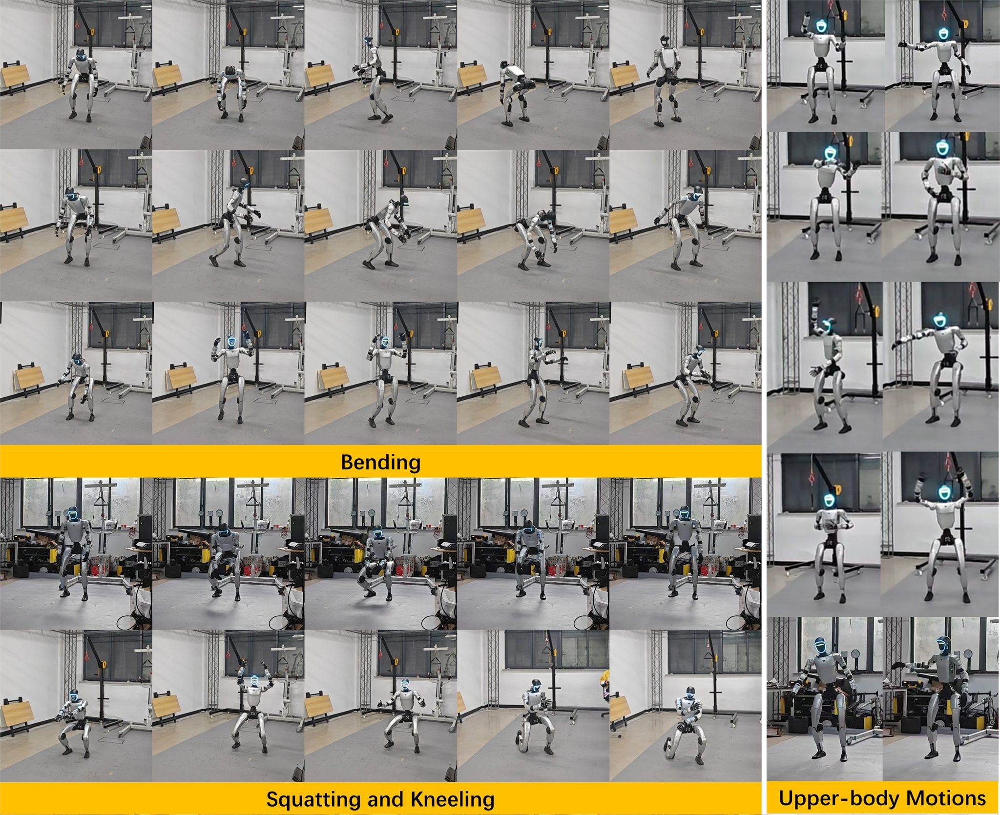
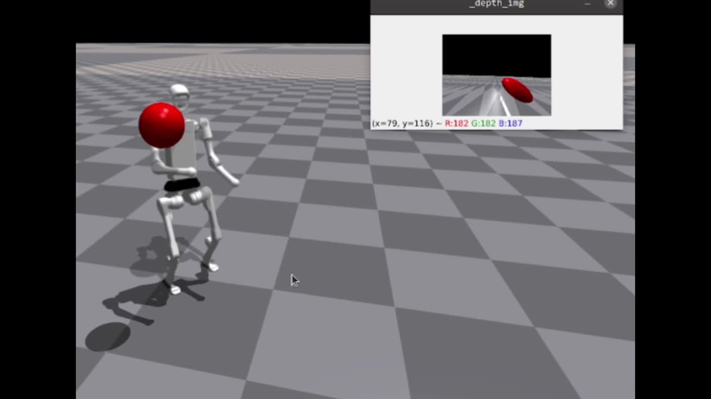

# Anonnyyy

**Humanoid Robotics · Motion Planning · Embedded Systems**

I'm a robotics engineering student at **Zhejiang University**, working on humanoid motion planning and whole-body control.

我关注人形机器人的运动规划、全身控制与机器人学习，也喜欢搭建从电路到算法的完整系统。

[个人项目网站](https://anonnyyy.github.io/)

## Selected Projects / 代表项目

<table>
<tr>
<td width="280" align="center">

</td>
<td>
<h3><a href="https://anonnyyy.github.io/projects/three-point-controller/"> ASYNC-3PT / ASYNC-CA</a></h3>

面向低频头部与双手轨迹的人形机器人异步控制。结合时间索引、MPC 轨迹补全与自引导后训练，在仿真和 Unitree G1 实机上验证。

<strong>项目展示 · 研究代码暂未发布</strong>

<a href="https://anonnyyy.github.io/projects/three-point-controller/">项目介绍</a> · <a href="https://anonnyyy.github.io/projects/three-point-controller/paper/paper.pdf">论文</a> · <a href="https://anonnyyy.github.io/projects/three-point-controller/#video">演示视频</a>

</td>
</tr>
</table>

<table>
<tr>
<td width="280" align="center">

</td>
<td>
<h3><a href="https://anonnyyy.github.io/projects/rcar-humanoid-reaching/">RCar · Guided Diffusion Planning</a></h3>

本科毕设：基于扩散策略与模仿学习的人形机器人运动规划与控制。通过运动先验生成任务数据，结合扩散规划与全身跟踪，在 H1 仿真中完成视觉目标到达。

<strong>项目展示 · 研究代码暂未发布</strong>

<a href="https://anonnyyy.github.io/projects/rcar-humanoid-reaching/">项目介绍</a> · <a href="https://anonnyyy.github.io/projects/rcar-humanoid-reaching/paper/rcar.pdf">论文</a> · <a href="https://anonnyyy.github.io/projects/rcar-humanoid-reaching/#video">演示视频</a>

</td>
</tr>
</table>

<table>
<tr>
<td width="280" align="center">

</td>
<td>
<h3><a href="https://github.com/Anonnyyy/signal-separation-2023">HandDream · 信号分离装置</a></h3>

基于 STM32、FFT 与 AD9833 DDS 实现信号分析和波形复现，通过锁相检测与频率调节实现闭环跟踪。

<strong>2023 全国大学生电子设计竞赛 H 题 · 全国一等奖</strong>

山东大学 · 吴浩瀚、曹志君、刘雨萌

<a href="https://github.com/Anonnyyy/signal-separation-2023">项目介绍</a> · <a href="https://oshwhub.com/23dian-sai-xiao-sai/23dian-sai-ce-liang-ti">代码、设计与测试视频</a>

</td>
</tr>
</table>

三点控制器与 RCar 仓库目前公开论文、图片和演示资料，研究实现代码尚未发布。电赛代码与设计资料见嘉立创原项目，采用 CC BY-NC 3.0 协议。

## codex做的小玩具

### [Codex 工作流监管 App](https://github.com/Anonnyyy/codex-workbench)

一个本地运行的 Codex 工作台，集中查看 Windows / Linux 多台电脑上的会话进度、未读回复与任务分叉，支持拖动归类和远程设备接入。

[项目介绍与源码](https://github.com/Anonnyyy/codex-workbench) · [下载便携版](https://github.com/Anonnyyy/codex-workbench/releases/latest)
